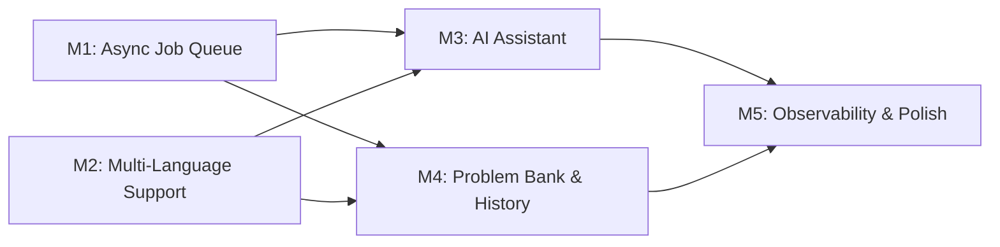
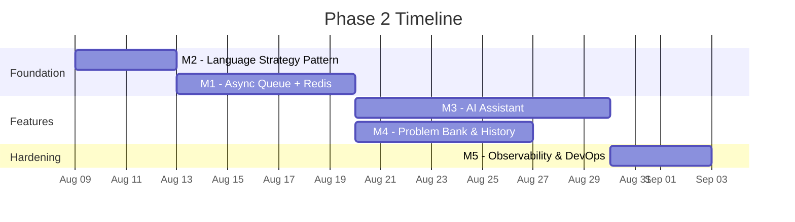

# Phase 2 Roadmap — Online Code Judge

## Where Phase 1 Ends

Your Phase 1 is a solid, working product:

| ✅ Done | Details |
|---------|---------|
| Sandboxed execution | Docker containers with read-only FS, network disabled, PID/memory limits, capabilities dropped, non-root user |
| Auth system | JWT + bcrypt, login/register/verify flows |
| Frontend | React 19 + Vite + Tailwind v4, code editor with line numbers, resizable panels, language selector (C/C++) |
| Test case runner | Custom input, expected output comparison, status badges (Accepted/Wrong Answer/TLE/MLE) |

### Current Limitations (What Phase 2 Solves)

| Problem | Impact |
|---------|--------|
| **Synchronous execution** — Flask blocks on `process_code()` | One slow submission stalls the server for everyone |
| **Hard-coded language logic** — `if C … else C++` scattered through `compiling_service.py` | Adding Python/Java/Rust requires touching multiple functions |
| **No AI assistance** — users are on their own when stuck | Lost engagement, no differentiator from other judges |
| **No problem bank** — users must supply their own test cases | Can't function as a real competitive-programming platform |
| **No submission history** — results vanish on page reload | No learning feedback loop |
| **No observability** — no logging, metrics, or health checks | Impossible to debug in production |

---

## Phase 2 — Milestone Overview



| Milestone | Theme | Effort | Priority |
|-----------|-------|--------|----------|
| **M1** | Async Job Queue & WebSocket Feedback | ~1 week | 🔴 Critical |
| **M2** | Multi-Language Strategy Pattern | ~3–4 days | 🔴 Critical |
| **M3** | AI-Powered Coding Assistant (Agentic) | ~1–1.5 weeks | 🟡 High |
| **M4** | Problem Bank & Submission History | ~1 week | 🟡 High |
| **M5** | Observability, DevOps & Polish | ~3–4 days | 🟢 Medium |

---

## M1 — Async Job Queue & Real-Time Feedback

> **Goal:** Decouple code submission from execution so Flask never blocks.

### Why This Matters
Right now, when a user clicks "Run & Submit", the Flask process calls `process_code()` which spins up a Docker container, compiles, runs, and waits — all synchronously. If the code takes 4.9 seconds (near the timeout), the HTTP connection is held open the entire time. With 10 concurrent users, you'll hit Flask's worker limit and everyone stalls.

### Architecture

```
┌─────────┐     POST /execute_code     ┌───────────┐     enqueue     ┌─────────────┐
│ Frontend │ ─────────────────────────► │  Flask API │ ──────────────► │ Redis Queue  │
│ (React)  │                            │            │                 │   (RQ/Celery)│
│          │ ◄── WebSocket (result) ──  │            │                 └──────┬───────┘
└─────────┘                             └───────────┘                        │
                                                                             │ dequeue
                                                                      ┌─────▼───────┐
                                                                      │   Worker(s)  │
                                                                      │ Docker exec  │
                                                                      └──────────────┘
```

### What Changes

#### Backend

| File | Change |
|------|--------|
| **[NEW] `backend/services/queue_service.py`** | Redis connection, job enqueue/dequeue, job status polling |
| **[NEW] `backend/services/worker.py`** | Standalone worker process that pulls from the queue and calls `process_code()` |
| **[MODIFY] `backend/app.py`** | `/execute_code` becomes async — enqueues job, returns `job_id` immediately. New endpoint: `GET /job_status/<job_id>` or WebSocket channel |
| **[MODIFY] `backend/services/compiling_service.py`** | Extract `process_code` into a standalone callable (it already is — just needs result persistence) |

#### Frontend

| File | Change |
|------|--------|
| **[MODIFY] `ResultPanel.tsx`** | After submission, poll `GET /job_status/<id>` every 1s (or subscribe via WebSocket). Show a progress indicator with stages: `Queued → Compiling → Running → Done` |

### Tech Choice

> [!TIP]
> **Redis + RQ (Redis Queue)** is the simplest path — it's a Python library, minimal setup, and Redis can also serve as the cache layer for M3 (AI responses) and M4 (submission results). Celery is more powerful but overkill at this scale.

### Key Decisions
- **Polling vs WebSocket**: Start with polling (`GET /job_status/<id>` every 1–2s). It's simpler, stateless, and good enough. Add WebSocket (Flask-SocketIO) later if you want real-time streaming of execution output.
- **Result storage**: Store job results in Redis with a 1-hour TTL. This avoids hitting PostgreSQL for ephemeral data.

---

## M2 — Multi-Language Strategy Pattern

> **Goal:** Adding a new language = adding one config entry, not modifying code.

### Why This Matters
Currently, `compiling_service.py` has `if language == "C"` / `else` branches in 3 places (file extension, write command, compile command). Adding Python, Java, or Rust means editing every branch. This violates the Open/Closed Principle and becomes a maintenance nightmare.

### Design

#### Language Registry (JSON config)

```json
{
  "C": {
    "image": "code_runner_image",
    "extension": ".c",
    "compile_cmd": "gcc main.c -o main",
    "run_cmd": "./main < input.txt",
    "timeout": 5,
    "memory": "200m"
  },
  "C++": {
    "image": "code_runner_image",
    "extension": ".cpp",
    "compile_cmd": "g++ main.cpp -o main",
    "run_cmd": "./main < input.txt",
    "timeout": 5,
    "memory": "200m"
  },
  "Python": {
    "image": "python_runner_image",
    "extension": ".py",
    "compile_cmd": null,
    "run_cmd": "python3 main.py < input.txt",
    "timeout": 10,
    "memory": "256m"
  },
  "Java": {
    "image": "java_runner_image",
    "extension": ".java",
    "compile_cmd": "javac Main.java",
    "run_cmd": "java -cp . Main < input.txt",
    "timeout": 10,
    "memory": "512m"
  }
}
```

#### What Changes

| File | Change |
|------|--------|
| **[NEW] `backend/services/language_registry.json`** | Declarative config for all supported languages |
| **[NEW] `backend/services/language_executor.py`** | Generic `LanguageExecutor` class that reads the registry and handles compile/run uniformly |
| **[MODIFY] `backend/services/compiling_service.py`** | Replace all `if/else` branches with `LanguageExecutor.from_config(language)` |
| **[NEW] `backend/services/utilis/Dockerfile.python`** | Python sandbox image |
| **[NEW] `backend/services/utilis/Dockerfile.java`** | Java sandbox image |
| **[MODIFY] Frontend `CodeArea.tsx`** | Language dropdown reads from a `/languages` API endpoint instead of hard-coded `["C", "C++"]` |

### Key Design Decision

> [!IMPORTANT]
> **Interpreted vs Compiled languages**: For Python, there is no compile step — `compile_cmd` is `null`. The executor must handle this gracefully: if `compile_cmd` is null, skip compilation and go straight to run. This single `null` check replaces what would otherwise be another `if/else` branch per language.

---

## M3 — AI-Powered Coding Assistant (Agentic Feature) ⭐

> **Goal:** Toggle-able AI assistant that gives contextual help — code suggestions, error explanations, hints — via a chat-like prompt box integrated into the editor.

### Why This Is the Killer Feature
This is what makes your project stand out. Most code judges just run code and say "Wrong Answer". Yours will explain *why* it's wrong and *how* to fix it. This transforms the tool from a grading machine into a **learning platform**.

### UX Flow

```
┌──────────────────────────────────────────────────────────────────┐
│ ┌──────────────────────────┐  ┌────────────────────────────────┐ │
│ │     Code Editor          │  │        Test Cases              │ │
│ │                          │  │   Input: [______]              │ │
│ │  #include <stdio.h>      │  │   Expected: [______]          │ │
│ │  int main() {            │  │                                │ │
│ │    printf("hello");      │  │   [Run & Submit]               │ │
│ │    return 0;             │  │                                │ │
│ │  }                       │  │   Output: ✅ Accepted          │ │
│ │                          │  │                                │ │
│ └──────────────────────────┘  └────────────────────────────────┘ │
│                                                                   │
│  [🤖 AI Assistant: ON ─────────────────────────────────────────]  │
│  ┌──────────────────────────────────────────────────────────────┐ │
│  │  💬 "Your code has a segfault on line 5 because you're      │ │
│  │     dereferencing a NULL pointer. Try checking if `ptr`     │ │
│  │     is NULL before accessing it."                           │ │
│  │                                                              │ │
│  │  You: [How do I fix the memory leak on line 12?___] [Send]  │ │
│  └──────────────────────────────────────────────────────────────┘ │
└──────────────────────────────────────────────────────────────────┘
```

### Architecture

```
┌─────────┐   user prompt + code context    ┌───────────┐    LLM API call    ┌──────────┐
│ Frontend │ ──────────────────────────────► │  Flask    │ ─────────────────► │ LLM API  │
│ AI Panel │                                 │ /ai/chat  │                    │ (Gemini/ │
│          │ ◄── streamed AI response ────── │           │ ◄──── response ─── │  OpenAI) │
└─────────┘                                  └───────────┘                    └──────────┘
```

### Three Modes of AI Assistance

| Mode | Trigger | What It Does |
|------|---------|-------------|
| **1. Error Explainer** | Automatic — fires after a failed submission | Takes the compiler error or runtime error + user's code → sends to LLM → returns a plain-English explanation with a fix suggestion |
| **2. Hint Generator** | User clicks "Get Hint" on a problem | Takes the problem statement + user's current (partial) code → returns a conceptual hint without giving away the full solution |
| **3. Free Chat** | User types in the prompt box | Open-ended conversation about the code. Context-aware: the AI always sees the current code, language, and last execution result |

### What Changes

#### Backend

| File | Change |
|------|--------|
| **[NEW] `backend/services/ai_service.py`** | Core AI service: manages LLM API calls, prompt construction, response streaming. Contains the system prompt that constrains the AI (no full solutions, educational hints only) |
| **[MODIFY] `backend/app.py`** | New endpoint: `POST /ai/chat` — accepts `{code, language, error, prompt, mode}`, returns AI response. Rate-limited per user (e.g., 20 requests/hour) |
| **[NEW] `backend/services/rate_limiter.py`** | Token-bucket or sliding-window rate limiter for AI endpoint (prevents abuse / API cost explosion) |

#### Frontend

| File | Change |
|------|--------|
| **[NEW] `frontend/src/components/AIAssistant.tsx`** | Collapsible AI panel at the bottom of the editor. Contains the toggle switch, chat history, and prompt input |
| **[MODIFY] `MainPage.tsx`** | Add AI toggle state, pass code/error context down to `AIAssistant` |
| **[MODIFY] `ResultPanel.tsx`** | After a failed submission, show a "🤖 Explain this error" button that triggers the Error Explainer mode |

### System Prompt Design (Critical)

The system prompt is what makes this "agentic" vs just "a chatbot wrapper". Here's the design:

```
You are a coding tutor embedded in an online code judge.

CONTEXT (injected per request):
- Language: {language}
- User's code: {code}
- Compilation error (if any): {compile_error}
- Runtime error (if any): {runtime_error}
- Expected output: {expected}
- Actual output: {actual}

RULES:
1. NEVER give the complete solution. Give hints, explanations, and partial fixes.
2. If the user has a compilation error, explain it in plain English and point to the exact line.
3. If the user has a wrong answer, compare expected vs actual and suggest what logic might be wrong.
4. If the user asks for help on an algorithm, explain the approach conceptually first.
5. Be encouraging. Use analogies when explaining complex concepts.
6. Keep responses concise (under 200 words unless the user asks for detail).
```

### LLM Provider Choice

> [!TIP]
> **Recommended: Google Gemini API (free tier)** — generous free quota (15 RPM, 1M tokens/day on `gemini-2.0-flash`), fast, and no credit card required. This keeps your project cost-free for development and demo. You can add OpenAI as a fallback later.

### Key Design Decisions

> [!IMPORTANT]
> **Streaming vs Batch**: For the best UX, stream the AI response token-by-token using Server-Sent Events (SSE). The frontend renders words as they arrive, making the AI feel responsive. Flask supports this natively with `Response(generate(), mimetype='text/event-stream')`.

> [!WARNING]
> **Cost Control**: Without rate limiting, a single user could burn through your API quota in minutes. Implement per-user rate limits (stored in Redis from M1) and a global daily cap. Display remaining quota to users in the UI.

---

## M4 — Problem Bank & Submission History

> **Goal:** Transform from "paste your code and run" into a real competitive programming platform.

### What This Adds

1. **Problem Bank**: Admin can create problems with title, description, difficulty, and hidden test cases
2. **Submission History**: Every submission is stored with code, result, timestamp — users can review past attempts
3. **Leaderboard** (optional): Track solved-problem counts per user

### Database Schema Additions

```sql
-- Problems table
CREATE TABLE problems (
    id SERIAL PRIMARY KEY,
    title VARCHAR(255) NOT NULL,
    description TEXT NOT NULL,
    difficulty VARCHAR(20) DEFAULT 'easy',  -- easy, medium, hard
    created_at TIMESTAMP DEFAULT NOW()
);

-- Test cases (hidden from users)
CREATE TABLE test_cases (
    id SERIAL PRIMARY KEY,
    problem_id INTEGER REFERENCES problems(id),
    input TEXT NOT NULL,
    expected_output TEXT NOT NULL,
    is_sample BOOLEAN DEFAULT FALSE  -- sample cases shown to user
);

-- Submission history
CREATE TABLE submissions (
    id SERIAL PRIMARY KEY,
    user_id INTEGER REFERENCES users(id),
    problem_id INTEGER REFERENCES problems(id),
    code TEXT NOT NULL,
    language VARCHAR(20) NOT NULL,
    status VARCHAR(20) NOT NULL,      -- ACCEPTED, WRONG_ANSWER, TLE, MLE, CE
    execution_time_ms INTEGER,
    submitted_at TIMESTAMP DEFAULT NOW()
);
```

### What Changes

#### Backend

| File | Change |
|------|--------|
| **[NEW] `backend/services/problem_service.py`** | CRUD for problems and test cases |
| **[NEW] `backend/services/submission_service.py`** | Store/retrieve submission history |
| **[MODIFY] `backend/app.py`** | New endpoints: `GET /problems`, `GET /problems/<id>`, `POST /submit/<problem_id>`, `GET /submissions` |

#### Frontend

| File | Change |
|------|--------|
| **[NEW] `frontend/src/components/ProblemList.tsx`** | Browse problems by difficulty, search |
| **[NEW] `frontend/src/components/ProblemView.tsx`** | Read problem statement + sample cases, then code |
| **[NEW] `frontend/src/components/SubmissionHistory.tsx`** | Table of past submissions with filters |
| **[MODIFY] `App.tsx`** | New routes: `/problems`, `/problems/:id`, `/submissions` |

---

## M5 — Observability, DevOps & Polish

> **Goal:** Make the system production-ready and debuggable.

### What This Adds

| Feature | Implementation |
|---------|---------------|
| **Structured logging** | Python `logging` module → JSON format, log every submission with `job_id`, `user_id`, `language`, `status`, `duration_ms` |
| **Health check endpoint** | `GET /health` — checks DB connection, Redis connection, Docker daemon availability |
| **Docker Compose** | Single `docker-compose.yml` that brings up PostgreSQL, Redis, Flask API, and Worker(s) |
| **Environment config** | Move all config to `.env` with validation at startup (fail fast if `SECRET_KEY` not set) |
| **Error handling** | Global Flask error handler, proper HTTP status codes (currently everything returns 200) |
| **Auth middleware** | Replace manual `validate_token()` calls with a `@require_auth` decorator (as noted in your `note` file) |

### What Changes

| File | Change |
|------|--------|
| **[NEW] `docker-compose.yml`** | Full stack orchestration |
| **[NEW] `backend/middleware.py`** | `@require_auth` decorator that extracts + validates JWT from `Authorization` header |
| **[MODIFY] `backend/app.py`** | Use `@require_auth` instead of manual token checks, add `/health`, add global error handler |
| **[NEW] `backend/config.py`** | Centralized configuration with validation |

---

## Suggested Implementation Order



> [!IMPORTANT]
> **Start with M2** (Language Strategy Pattern) — it's the smallest milestone and immediately cleans up your backend architecture. Then M1 (Queue) because M3 and M4 both benefit from having async infrastructure and Redis already in place.

---

## Open Questions

> [!IMPORTANT]
> 1. **LLM Provider**: Are you okay with Google Gemini (free tier) for the AI feature, or do you have an OpenAI API key you'd prefer to use?
> 2. **Scope of AI**: Should the AI be able to see the full problem statement (from M4) when giving hints? This makes it much more useful but also means M3 and M4 are coupled.
> 3. **Problem Bank Source**: Do you want to manually create problems, or scrape/import from sources like Codeforces/LeetCode?
> 4. **Deployment target**: Are you planning to deploy this (e.g., on a VPS/cloud), or is it a demo/portfolio project? This affects how much M5 work is worth doing.
> 5. **Do you want to start with M2 (cleanest, quickest win) or jump straight to M3 (the AI feature you're most excited about)?**
